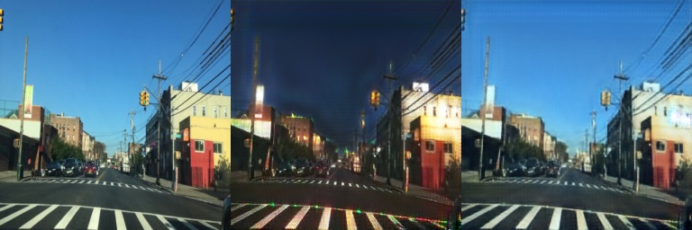
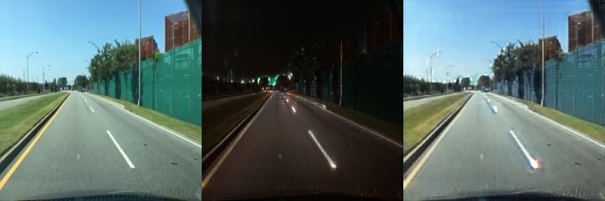
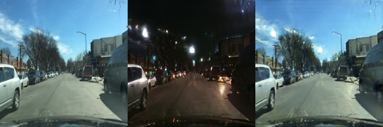

# PyTorch GAN Koleksiyonu

Yapay zeka ile **yeni görüntü üretimi** ve **görüntü stil dönüşümü** (ör. **gündüz → gece**, **gece → gündüz**) için PyTorch ile geliştirilmiş bir proje koleksiyonu. CycleGAN ile **eşleştirilmiş (paired) girdi–çıktı çiftlerine ihtiyaç duymadan** iki görüntü kümesi arasında dönüşüm mümkündür.

### CycleGAN karşılaştırma şeritleri (`assets/`)

Her görsel yatay **3 panel**: **orijinal** → **hedef domaine çeviri** → **cycle ile geri oluşturma** (dashcam / sokak senaryosu, gündüz↔gece).

| Örnek | Örnek | Örnek |
|:---:|:---:|:---:|

|  |  |
|  |  |  |


---

## Bu repo ne işe yarar?

- **Görüntü üretimi:** Gürültüden öğrenilmiş dağılıma uygun yeni görüntüler (ör. el yazısı rakamlar).
- **Gündüz / gece dönüşümü:** CycleGAN ile sokak veya sahne görüntülerini gündüzden geceye veya tersine çevirme.
- **Diğer stil örnekleri (aynı çerçeve):** Yaz↔kış, at↔zebra vb. — veri kümeleri uygun olduğunda aynı mimariyle eğitilebilir.

**“Paired veri yok” ne demek?** Aynı kadrajın gündüz ve gece fotoğrafı çiftlerini vermek zorunda değilsin; yeter ki bir klasörde gündüz, başkada gece örnekleri olsun. Model iki “domain” arasındaki ilişkiyi Cycle tutarlılığı ve adversarial öğrenme ile öğrenir.

---

## Özellikler

| Bileşen | Açıklama |
|--------|----------|
| **CycleGAN** | 2 generator + 2 discriminator, PatchGAN, cycle / identity / LSGAN kayıpları, residual bloklar |
| **MNIST GAN** | Klasik taban çizgisi, `mnist_gan/` altında |
| **DCGAN** | Konvolüsyon tabanlı üretici ayrımı |
| **Conditional GAN** | Etiket ile yönlendirilmiş üretim |
| **WGAN** | Wasserstein / daha stabil eğitim fikirleri |
| **Metrikler** | FID, Inception Score (`metrics.py`) |
| **Demo arayüz** | Gradio (`web_app.py` — ayrıca `gradio` kurulumu gerekir) |

---

## Kurulum

```bash
git clone https://github.com/KULLANICI_ADIN/REPO_ADIN.git
cd REPO_ADIN
python -m venv .venv
.venv\Scripts\activate
pip install -r requirements.txt
```

Gradio arayüzü için:

```bash
pip install gradio
```

CycleGAN için veri indirme / Kaggle yardımcıları: `cyclegan/` içindeki rehber dosyalara bakın; isteğe bağlı: `pip install kaggle`.

---

## Hızlı kullanım

### CycleGAN (gündüz–gece vb.)

```bash
cd cyclegan
python create_demo_dataset.py 30
python cyclegan_train.py
python cyclegan_test.py
```

### MNIST GAN

```bash
cd mnist_gan
python train.py
```

### Ana klasördeki ek scriptler

Fashion-MNIST eğitimi (`train_fashion.py`), üretim (`generate.py`, `generate_fashion.py`) ve diğer modüller kök dizinde; ayrıntılar için ilgili `.py` dosyalarının başındaki açıklamalara bakın.

---

## Proje yapısı (özet)

```
.
├── assets/                 # comparison_*.jpg — 3 panelli README örnekleri
├── cyclegan/               # CycleGAN model, eğitim, veri hazırlığı
├── mnist_gan/              # MNIST üretim pipeline’ı
├── model_dcgan.py
├── model_conditional.py
├── wgan_improvements.py
├── metrics.py
├── web_app.py
├── requirements.txt
└── README.md
```

---

## Örnek görseller nereye konur?

1. Repo kökünde **`assets/`** klasörüne koy.
2. README, **`checkpoint_karsilastirma.py` / test çıktılarıyla uyumlu** şu isimleri kullanır (3 panelli şeritler):
   - `comparison_0000.jpg` … `comparison_0103.jpg` (senin kullandığın set: 9 dosya, `comparison_*.jpg` veya `.png`)
3. `cyclegan/` altında örneğin `cyclegan_day2night_results/checkpoint_comparison_epoch_*/day2night/` veya `night2day/` içindeki `comparison_XXXX.jpg` dosyalarını buraya kopyalayabilirsin; README’deki numaraları değiştirdiysen üstteki tabloda dosya adlarını da güncelle.

Dosya boyutu büyükse GitHub için kalite / çözünürlük düşürmeyi düşünebilirsin.

---

## GitHub’a ne yüklemeli, ne yüklememeli?

**Yükle (önerilen):**

- Tüm `.py` kaynakları, `requirements.txt`, bu `README.md`
- `assets/` içindeki örnek görseller
- `mnist_gan/`, `cyclegan/` altındaki kod ve `.md` rehberleri
- İstersen küçük örnek veri veya örnek çıktı (boyuta dikkat)

**Genelde yükleme:**

- `.venv/` veya sanal ortam klasörü
- `__pycache__/`, IDE ayarları
- Çok büyük eğitim veri setleri (Git LFS veya harici link düşün)
- Onlarca megabaytı aşan checkpoint’ler — `.gitignore` zaten `*.pt`, `*.pth` ve `checkpoints/` için uyarıyor; eğitilmiş modeli paylaşacaksan [Releases](https://docs.github.com/en/repositories/releasing-projects-on-github/about-releases) veya Drive/Hugging Face kullanmak daha uygun

Mevcut `.gitignore` eğitim çıktıları ve checkpoint’leri dışlamaya göre ayarlanmış; `assets/` altındaki örnek görseller özellikle takip edilecek şekilde açılmıştır.

---

## Konular (GitHub Topics) önerisi

`pytorch`, `gan`, `cyclegan`, `image-to-image-translation`, `day-to-night`, `deep-learning`, `computer-vision`, `python`

---

## İngilizce kısa özet

> PyTorch implementations of GAN variants (Vanilla, DCGAN, cGAN, WGAN) and **CycleGAN for unpaired day↔night (and similar) image translation**, with training scripts, optional Gradio UI, and FID/Inception-style evaluation helpers. **Sample results** live in `assets/`.

---

## Sorun giderme

| Sorun | Çözüm |
|--------|--------|
| `torch` bulunamıyor | `pip install torch torchvision` |
| CycleGAN verisi yok | `cyclegan/CYCLEGAN_BASLANGIC.md` |
| README’de görseller görünmüyor | `assets/` içinde doğru dosya adları + commit + push |

---

İç klasörlerdeki `README.md` ve `CYCLEGAN_BASLANGIC.md` dosyaları daha ayrıntılı kullanım içindir.
